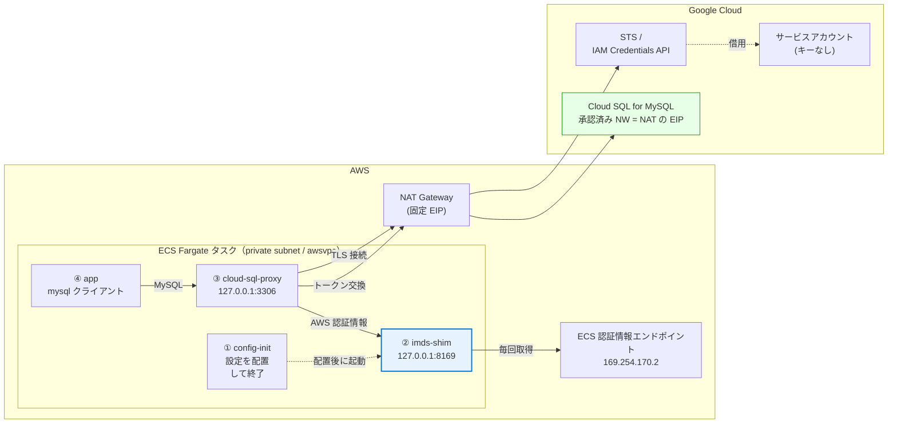
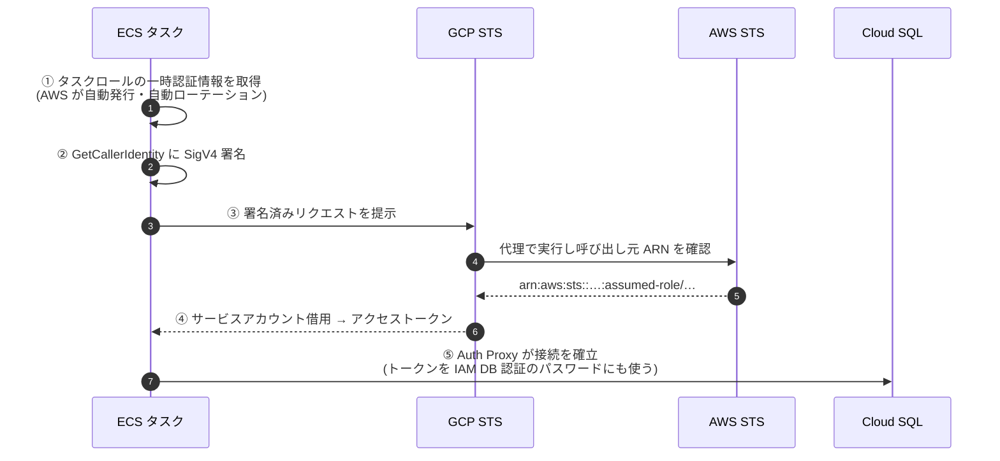

# AWS ECS Fargate → Cloud SQL for MySQL (キーレス / Workload Identity 連携)

AWS ECS Fargate 上のコンテナから Google Cloud の Cloud SQL for MySQL へ、
**サービスアカウントキーを一切使わずに**接続するための Terraform 構成です。

- 認証: Workload Identity 連携（ECS タスクロール → GCP サービスアカウント借用）
- 接続: Cloud SQL Auth Proxy をサイドカーとして同一タスク内で実行
- DB 認証: IAM データベース認証（`--auto-iam-authn`）によりパスワードも不要

> 📖 **なぜこの構成になっているのか** — Fargate では公式ドキュメントどおりの設定では
> Workload Identity 連携が動きません。その理由と解決策の比較を図つきで解説しています:
> **[docs/fargate-workload-identity.md](docs/fargate-workload-identity.md)**

## 構成



### 認証の流れ（キーが登場しない理由）



いずれの段階でも長期のシークレットは保存されません。

## ⚠️ Fargate 固有の注意点（この構成の要）

GCP の認証ライブラリ（Cloud SQL Auth Proxy が使う Go 版を含む）は、
Workload Identity 連携の AWS 認証情報を **EC2 IMDS (`169.254.169.254`) からしか
取得しません**。Fargate には EC2 IMDS が無く、認証情報は
`169.254.170.2$AWS_CONTAINER_CREDENTIALS_RELATIVE_URI` にあるため、
公式ドキュメントどおりの `credential_source` では接続できません。

- 対応要望: [googleapis/google-cloud-go#13479](https://github.com/googleapis/google-cloud-go/issues/13479)（未解決）
- Java 版では [PR #1374](https://github.com/googleapis/google-auth-library-java/pull/1374) で対応済み

よく紹介される回避策は、起動時に ECS エンドポイントを叩いて
`AWS_ACCESS_KEY_ID` などの環境変数へ展開する方法です。しかし
**ECS タスクロールの認証情報は約 6 時間で失効し、環境変数は更新されない**ため、
常駐サービスでは失効後に STS トークン交換が失敗します。
しかも**デプロイ直後のテストでは成功してしまう**のが厄介な点です。

そこで本構成では `files/imds_shim.py`（**EC2 IMDS 互換シム**）をサイドカーで動かし、
`127.0.0.1:8169` に IMDS 互換のエンドポイントを公開します。問い合わせのたびに
ECS エンドポイントから新鮮な認証情報を取得して返すため、**認証情報は自動更新され、
再起動なしで無期限に動作します**。Cloud SQL Auth Proxy 側は `credential_source` の
URL をこのシムに向けるだけです。

シムは Python 標準ライブラリのみで動作します（依存パッケージなし）。単体テスト:

```bash
python3 files/test_imds_shim.py
```

> 詳しい背景、他の解決策（カスタム supplier 方式など）との比較、選定フローチャートは
> **[docs/fargate-workload-identity.md](docs/fargate-workload-identity.md)** を参照してください。

## 事前準備

- GCP: プロジェクトに対する編集権限（`terraform` 実行用の ADC を設定済み）
  ```bash
  gcloud auth application-default login
  ```
- AWS: 認証情報を設定済み（`aws sts get-caller-identity` が通ること）

## デプロイ

```bash
cp terraform.tfvars.example terraform.tfvars
$EDITOR terraform.tfvars   # 少なくとも gcp_project_id を設定

terraform init
terraform plan
terraform apply
```

適用後、動作確認:

```bash
eval "$(terraform output -raw logs_command)"
```

`app` コンテナのログに以下のような出力が出れば成功です。

```
+---------------------+--------------------------------------+
| now                 | connected_as                         |
+---------------------+--------------------------------------+
| 2026-09-28 12:34:56 | sql-client@my-gcp-project.iam@%      |
+---------------------+--------------------------------------+
```

## 適用後に必要な作業: データベースへの GRANT

IAM データベース認証で作成されたユーザーには、**既定でどのデータベースへの
権限も付与されません**（接続はできるが `USE appdb` ができない）。
Cloud SQL には GRANT を発行する API が無いため、SQL で一度だけ実行します。

管理ユーザーの資格情報を取得:

```bash
terraform output -raw db_admin_user
terraform output -raw db_admin_password
terraform output -raw cloudsql_public_ip
terraform output -raw iam_db_user
```

Cloud SQL Studio、または `gcloud sql connect` などから管理ユーザーで接続し、

```sql
GRANT SELECT, INSERT, UPDATE, DELETE ON appdb.* TO 'sql-client@my-gcp-project.iam'@'%';
FLUSH PRIVILEGES;
```

> `terraform output -raw iam_db_user` の値をそのままユーザー名に使ってください。
> 管理ユーザーはこの GRANT のためだけのもので、アプリケーションからは使いません。
> 不要であれば GRANT 後に `google_sql_user.admin` と `random_password.admin` を
> 削除して構いません。

## ファイル構成

| ファイル | 内容 |
| --- | --- |
| `gcp_apis.tf` | 必要な GCP API の有効化 |
| `gcp_workload_identity.tf` | Workload Identity プール / プロバイダ / サービスアカウントと IAM |
| `gcp_cloudsql.tf` | Cloud SQL インスタンス、IAM DB ユーザー、管理ユーザー |
| `aws_iam.tf` | ECS タスクロール / タスク実行ロール |
| `aws_network.tf` | VPC、サブネット、NAT Gateway、セキュリティグループ |
| `aws_ecs.tf` | ECS クラスタ、タスク定義（4 コンテナ）、サービス |
| `files/imds_shim.py` | EC2 IMDS 互換シム |
| `files/test_imds_shim.py` | シムの単体テスト |
| `docs/fargate-workload-identity.md` | **設計の背景解説**（図つき・解決策の比較） |

## セキュリティ上のポイント

- **サービスアカウントキーを作成しない**（`google_service_account_key` は未使用）
- Workload Identity プロバイダの `attribute_condition` により、
  **指定した ECS タスクロール以外からのトークン交換を拒否**
  （AWS アカウント ID だけの制限では、同一アカウント内の任意のロールから
  借用できてしまうため）
- サービスアカウントの借用権限は `principalSet://.../attribute.aws_role/<ARN>` に限定
- サービスアカウントの権限は `roles/cloudsql.client` と
  `roles/cloudsql.instanceUser` のみ
- Cloud SQL は `ssl_mode = ENCRYPTED_ONLY`、承認済みネットワークは NAT の EIP のみ
- セキュリティグループはインバウンドなし（Auth Proxy は `127.0.0.1` で待受）
- タスクは NAT 経由のプライベートサブネット配置（パブリック IP なし）

## コストに関する注意

- **NAT Gateway** が常時課金されます（東京リージョンで約 $0.062/時 ≒ 月 $45 + データ処理料）。
  Fargate にパブリック IP を直付けすると IP が固定できず Cloud SQL の
  承認済みネットワークに登録できないため、送信元 IP 固定のために必要です。
- Cloud SQL（既定 `db-f1-micro`）と Fargate タスク（0.5 vCPU / 1 GB）も常時課金されます。
- 検証後は `terraform destroy` で削除してください。

## バリエーション

### パブリック IP を使わず、プライベート接続にする

AWS ↔ GCP 間に Cloud Interconnect / HA VPN がある場合は、より安全な構成にできます。

1. `gcp_cloudsql.tf` の `ip_configuration` を以下に変更
   ```hcl
   ip_configuration {
     ipv4_enabled    = false
     private_network = "projects/<proj>/global/networks/<vpc>"
   }
   ```
2. `aws_ecs.tf` の Auth Proxy の command に `--private-ip` を追加
3. NAT Gateway は不要（ただし ECR / GCP API へのアクセス経路は別途確保）

### タスクをバッチ（短命）用途にする場合

タスクが 6 時間未満で終了するなら、IMDS シムを省いて環境変数方式で済ませられます。
`config-init` で ECS エンドポイントから認証情報を取得し、
`AWS_ACCESS_KEY_ID` / `AWS_SECRET_ACCESS_KEY` / `AWS_SESSION_TOKEN` を
Auth Proxy に渡してください（`credential_source` は無視されます）。
常駐サービスでは失効するため使えません。

## 参考

- **[docs/fargate-workload-identity.md](docs/fargate-workload-identity.md)** — 設計の背景と解決策の比較（図つき）
- [Configure Workload Identity Federation with AWS or Azure](https://docs.cloud.google.com/iam/docs/workload-identity-federation-with-other-clouds)
- [Cloud SQL: IAM データベース認証](https://docs.cloud.google.com/sql/docs/mysql/iam-authentication)
- [Fargate で Workload Identity を使うベストな方法 | DevelopersIO](https://dev.classmethod.jp/articles/best-way-to-use-fargate-workload-identity/)
- [google-cloud-go#13479: auth: support AWS ECS default credentials detection](https://github.com/googleapis/google-cloud-go/issues/13479)
- [google-auth-library-java#1374: Support Workload Identity Federation on AWS ECS/Fargate](https://github.com/googleapis/google-auth-library-java/pull/1374)
