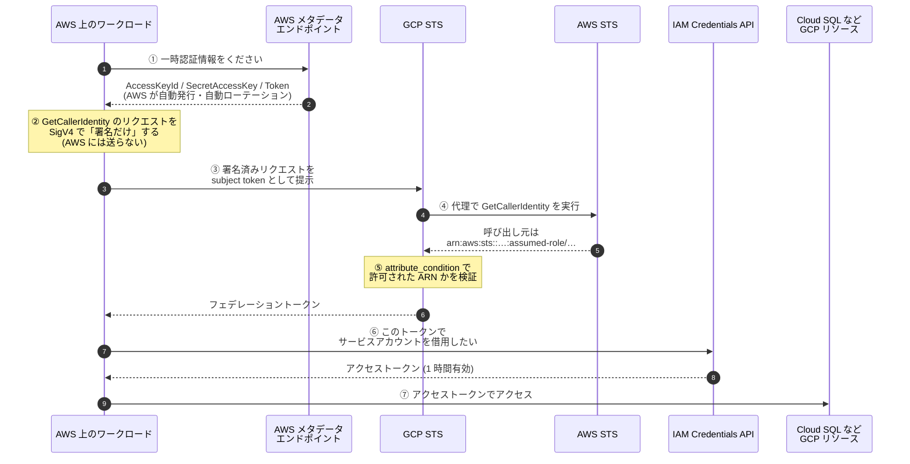
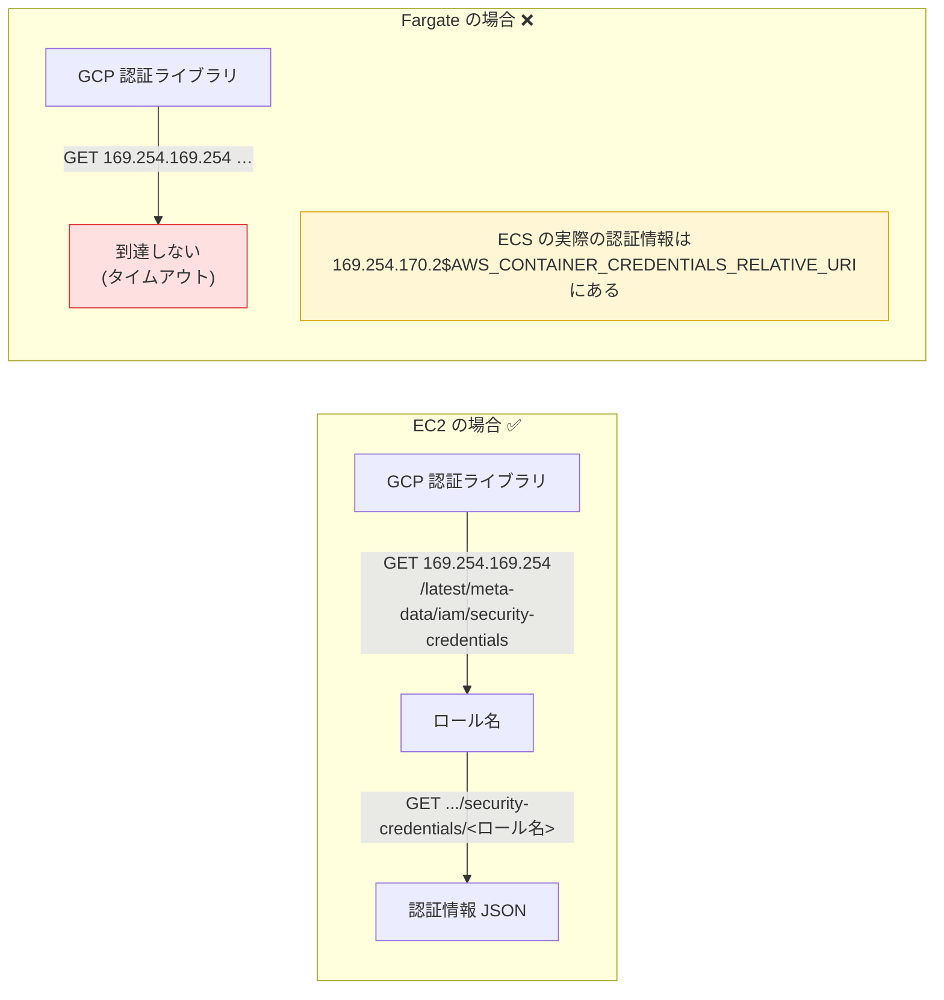
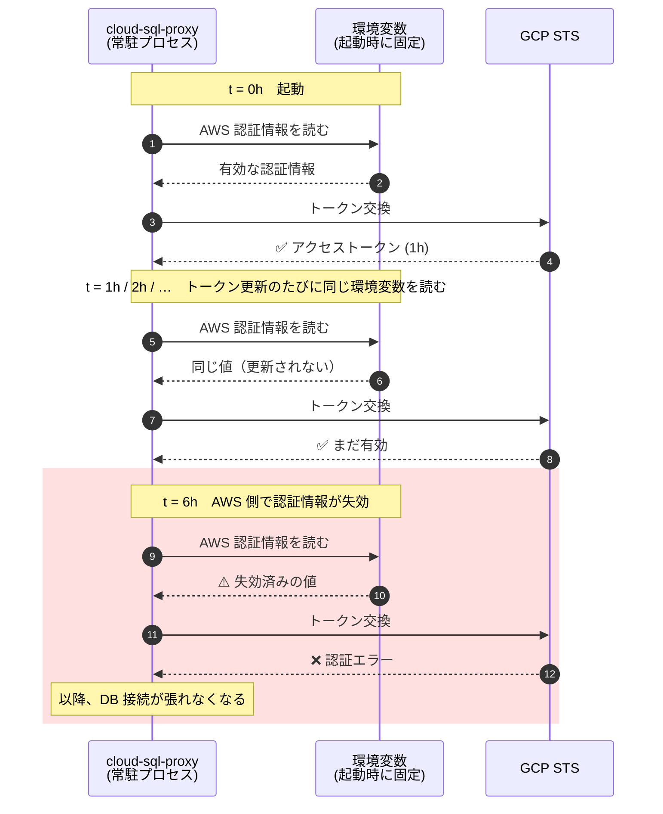
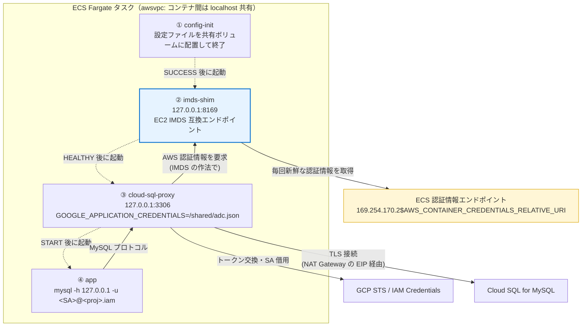
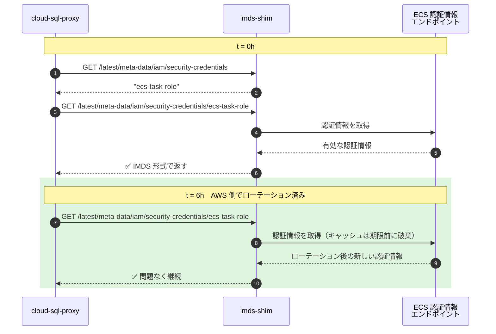
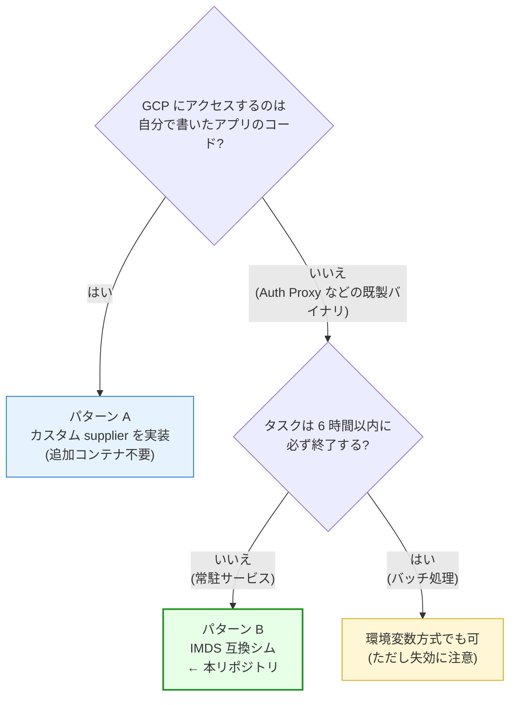

# なぜ Fargate では Workload Identity 連携が素直に動かないのか

AWS ECS Fargate から Google Cloud のリソースへ、**サービスアカウントキーを使わずに**
アクセスしたい。この要件は Workload Identity 連携で実現できますが、
**Fargate では公式ドキュメントどおりに設定しても動きません。**

このドキュメントでは、

1. そもそも Workload Identity 連携がどう動いているのか
2. なぜ EC2 では動いて Fargate では動かないのか
3. よく紹介される回避策が、なぜ **6 時間後に壊れる**のか
4. 本リポジトリが採用した解決策と、その選定理由

を順に説明します。

---

## 1. 前提: Workload Identity 連携は何をしているのか

「キーレス」と言われても、実際に何が起きているのかが分からないと、
どこで壊れているのかも分かりません。まず仕組みから見ます。



ポイントは **①** です。

Workload Identity 連携の出発点は、あくまで「**AWS の一時認証情報**」です。
これを AWS 上のどこから取ってくるか — ここが Fargate の問題の核心になります。

> 💡 GCP に渡しているのは「署名済みの GetCallerIdentity リクエスト」であって、
> アクセスキーそのものではありません。GCP 側がそれを AWS に投げ返して
> 「本当にこのロールの持ち主か」を確認する仕組みです。

---

## 2. EC2 では動く。Fargate では動かない

GCP の認証ライブラリは、この「AWS の一時認証情報」を
**EC2 のインスタンスメタデータサービス (IMDS) からしか取得しません。**

認証情報設定ファイル（`credential_source`）を見ると、
エンドポイントが **EC2 の IP でハードコードされている**のが分かります。

```jsonc
"credential_source": {
  "environment_id": "aws1",
  "region_url":               "http://169.254.169.254/latest/meta-data/placement/availability-zone",
  "url":                      "http://169.254.169.254/latest/meta-data/iam/security-credentials",
  "imdsv2_session_token_url": "http://169.254.169.254/latest/api/token",
  "regional_cred_verification_url": "https://sts.{region}.amazonaws.com?Action=GetCallerIdentity&Version=2011-06-15"
}
```

ところが **Fargate には EC2 IMDS がありません。**
ECS タスクの認証情報は、別のアドレスにある別形式のエンドポイントから取得します。



違いは 2 つあります。

| | EC2 IMDS | ECS タスクの認証情報エンドポイント |
| --- | --- | --- |
| アドレス | `169.254.169.254` | `169.254.170.2` + 環境変数 `AWS_CONTAINER_CREDENTIALS_RELATIVE_URI` |
| 取得手順 | **2 段階**（ロール名一覧 → ロール名を指定して取得） | **1 段階**（JSON を直接返す） |
| レスポンスのキー名 | `AccessKeyId` / `SecretAccessKey` / `Token` | （同じ） |

GCP の認証ライブラリはこの差を吸収してくれません。
結果として Fargate では、到達できない `169.254.169.254` を叩きに行って
タイムアウトします。

これはライブラリ側の既知の制限で、対応要望が出ています。

- Go 版（**Cloud SQL Auth Proxy が使っているのはこれ**）:
  [googleapis/google-cloud-go#13479](https://github.com/googleapis/google-cloud-go/issues/13479) — **2026 年 9 月時点で未解決**
- Java 版: [googleapis/google-auth-library-java#1374](https://github.com/googleapis/google-auth-library-java/pull/1374) で対応済み

---

## 3. NG な方法: 環境変数の上書き（6 時間で壊れる）

Web 上でよく見つかる回避策が、これです。

> コンテナ起動時に ECS のエンドポイントを叩いて、
> `AWS_ACCESS_KEY_ID` / `AWS_SECRET_ACCESS_KEY` / `AWS_SESSION_TOKEN` に
> 展開してしまえばよい

```bash
# ❌ 常駐プロセスでは使わないこと
url="http://169.254.170.2${AWS_CONTAINER_CREDENTIALS_RELATIVE_URI}"
response=$(curl -sf "$url")
export AWS_ACCESS_KEY_ID=$(echo "$response" | jq -r '.AccessKeyId')
export AWS_SECRET_ACCESS_KEY=$(echo "$response" | jq -r '.SecretAccessKey')
export AWS_SESSION_TOKEN=$(echo "$response" | jq -r '.Token')

exec /cloud-sql-proxy --auto-iam-authn "$INSTANCE_CONNECTION_NAME"
```

GCP の認証ライブラリは `credential_source` の URL より**環境変数を優先する**ため、
これで確かに動きます。**最初のうちは。**

### なぜ壊れるのか

**ECS タスクロールの一時認証情報は、既定で約 6 時間で失効します**
（その前に ECS エージェントが自動でローテーションします）。
ところが、一度 `export` した環境変数はプロセスの中で固定されたままです。



厄介なのは、**デプロイ直後のテストでは必ず成功する**ことです。
問題が表面化するのは 6 時間後、つまり多くの場合は本番稼働後の夜間です。

> バッチ処理のように **6 時間以内に必ず終了する**タスクであれば、この方法でも
> 実害はありません。常駐サービスで使ってはいけない、という話です。

---

## 4. 解決の方向性は 1 つ: 「毎回取り直す」

原因がはっきりすれば、直し方も明確です。
**認証情報を固定せず、必要になるたびに ECS のエンドポイントから取り直せばよい。**

実現方法は、**アプリのコードを自分で書けるかどうか**で変わります。

### パターン A: アプリのコードを書ける場合 → カスタム supplier

GCP の認証ライブラリには、AWS 認証情報の取得処理を差し替える拡張点があります。
ここに AWS SDK の標準的な認証情報チェーン（ECS のエンドポイントを理解している）を
差し込みます。

```javascript
// Node.js の例
class AwsSupplier {
  async getAwsSecurityCredentials(context) {
    // 呼ばれるたびに AWS SDK 経由で取得 → 自動ローテーションに追従する
    const credentials = await fromNodeProviderChain()();
    return {
      accessKeyId:     credentials.accessKeyId,
      secretAccessKey: credentials.secretAccessKey,
      token:           credentials.sessionToken,
    };
  }
}
```

これが最もシンプルで、コンテナを増やす必要もありません。
**自前のアプリから GCP の API を呼ぶ場合は、この方法を推奨します。**

> この方法は [クラスメソッドの記事](https://dev.classmethod.jp/articles/best-way-to-use-fargate-workload-identity/)
> で詳しく解説されています。

### パターン B: 既製のバイナリを使う場合 → 本リポジトリの方式

ところが、**本リポジトリの用途ではパターン A が使えません。**

Cloud SQL への接続には **Cloud SQL Auth Proxy** を使います。これは配布済みの
バイナリであり、**内部の認証処理を差し替えるフックがありません**。
supplier を渡す口が無いのです。

そこで発想を変えます。

> ライブラリを Fargate に合わせられないなら、
> **Fargate の側を「EC2 のように見せかければ」よい。**

---

## 5. 採用した解決策: IMDS 互換シム

同一タスク内に小さな HTTP サーバー（**IMDS 互換シム**）を置き、
`127.0.0.1:8169` で **EC2 IMDS と同じ形式**のエンドポイントを公開します。
シムは問い合わせを受けるたびに ECS のエンドポイントから認証情報を取得して返します。

Auth Proxy 側は `credential_source` の向き先を `169.254.169.254` から
このシムに変えるだけ。**Auth Proxy から見れば、EC2 上で動いているのと区別がつきません。**



### 認証情報が更新され続ける様子



環境変数方式との違いは一点だけです。
**認証情報の供給元が「起動時に固定された値」ではなく「毎回問い合わせる相手」になった。**

### シムの実装（[`files/imds_shim.py`](../files/imds_shim.py)）

Python 標準ライブラリのみ、依存パッケージなしの約 190 行です。
公開しているエンドポイントは 4 つだけです。

| パス | 返すもの |
| --- | --- |
| `PUT /latest/api/token` | IMDSv2 のセッショントークン（値は検証されないのでダミー） |
| `GET /latest/meta-data/placement/availability-zone` | `ap-northeast-1a` のような AZ 名<br/>（ライブラリは末尾 1 文字を落としてリージョンとして扱う） |
| `GET /latest/meta-data/iam/security-credentials` | ロール名（固定文字列でよい） |
| `GET /latest/meta-data/iam/security-credentials/<ロール名>` | **ECS から取得した認証情報を IMDS 形式で返す** |

ECS とのやり取りで一点だけ注意が必要なのが、**キャッシュの期限判定**です。

```python
def _expires_soon(credentials):
    """認証情報の有効期限が近い (あるいは不明) かどうか。"""
    expiration = credentials.get("Expiration")
    if not expiration:
        return True
    try:
        expires_at = calendar.timegm(time.strptime(expiration, "%Y-%m-%dT%H:%M:%SZ"))
    except ValueError:
        # 想定外の書式なら安全側に倒して取り直す
        return True
    return expires_at - time.time() < _EXPIRY_MARGIN_SECONDS
```

単純な TTL キャッシュだけにすると「TTL は残っているが認証情報は失効寸前」という
状態が起こり得ます。**結局それでは 6 時間問題を小さく再現してしまう**ので、
`Expiration` を見て期限の 5 分前には必ず取り直すようにしています。

動作はモックを使った単体テストで検証できます。

```bash
python3 files/test_imds_shim.py
```

```
PASS  availability-zone: 'ap-northeast-1a'
PASS  derived region: 'ap-northeast-1'
PASS  AccessKeyId: 'ASIAFAKEFAKEFAKE'
PASS  ECS endpoint hits (cached): 1
PASS  refetch when expiring soon: 4
...
ALL CHECKS PASSED
```

### セキュリティ上の位置づけ

シムは新しい権限を作りません。**ECS がタスクに渡している認証情報を、
同じタスクの中で形式変換して渡しているだけ**です。

- 待ち受けは `127.0.0.1` のみ。同一タスク内のコンテナからしか到達できません
  （`awsvpc` モードではタスク内でネットワーク名前空間を共有します）
- セキュリティグループにインバウンド穴を開ける必要はありません
- 認証情報はディスクに書かれず、メモリ上に最大 5 分だけ保持されます

---

## 6. どの方法を選ぶべきか



| 方法 | 適用できる場面 | 長所 | 短所 |
| --- | --- | --- | --- |
| **A. カスタム supplier** | アプリのコードを書ける | 追加コンテナ不要・最小構成 | 言語ごとに実装が必要／既製バイナリには使えない |
| **B. IMDS 互換シム**（本構成） | 常駐サービス全般。既製バイナリでも可 | アプリ改変不要・言語非依存・無期限に安定 | サイドカーが 1 つ増える |
| C. 環境変数の上書き | 6 時間未満で終わるバッチのみ | 最も手軽 | **常駐サービスでは 6 時間後に壊れる** |
| D. EC2 起動タイプにする | Fargate を諦められる場合 | 公式ドキュメントどおりに動く | Fargate の運用上の利点を失う |

> なお、アプリが **Go** で書かれているなら、Auth Proxy をサイドカーとして
> 立てる代わりに [`cloudsqlconn`](https://github.com/GoogleCloudPlatform/cloud-sql-go-connector)
> をライブラリとして組み込み、パターン A（カスタム supplier）で解決する手もあります。
> この場合サイドカーは一切不要になります。

---

## 7. まとめ

- Workload Identity 連携の出発点は **AWS の一時認証情報**であり、
  GCP の認証ライブラリはそれを **EC2 IMDS からしか取得しない**
- Fargate に EC2 IMDS は無いため、**公式ドキュメントどおりの設定では動かない**
  （Go 版は [#13479](https://github.com/googleapis/google-cloud-go/issues/13479) で未対応）
- 環境変数へ展開する回避策は、**ECS タスクロールの認証情報が約 6 時間で失効する**ため
  常駐サービスでは破綻する。しかも**デプロイ直後のテストでは成功してしまう**
- 正しい方向は「**毎回取り直す**」の一点。アプリのコードを書けるならカスタム supplier、
  Auth Proxy のような既製バイナリを使うなら **IMDS 互換シム**

**キーレスにすることと、認証情報のローテーションに追従することは別の問題です。**
キーを無くしただけで安心せず、「その認証情報はいつ失効するのか」を
必ず確認してください。

---

## 参考

- [Configure Workload Identity Federation with AWS or Azure | Google Cloud](https://docs.cloud.google.com/iam/docs/workload-identity-federation-with-other-clouds)
- [Cloud SQL: IAM データベース認証](https://docs.cloud.google.com/sql/docs/mysql/iam-authentication)
- [Fargate で Workload Identity を使うベストな方法 | DevelopersIO](https://dev.classmethod.jp/articles/best-way-to-use-fargate-workload-identity/)
- [auth: support AWS ECS default credentials detection | google-cloud-go#13479](https://github.com/googleapis/google-cloud-go/issues/13479)
- [Support Workload Identity Federation on AWS ECS/Fargate | google-auth-library-java#1374](https://github.com/googleapis/google-auth-library-java/pull/1374)
- [タスク IAM ロール | Amazon ECS デベロッパーガイド](https://docs.aws.amazon.com/ja_jp/AmazonECS/latest/developerguide/task-iam-roles.html)
